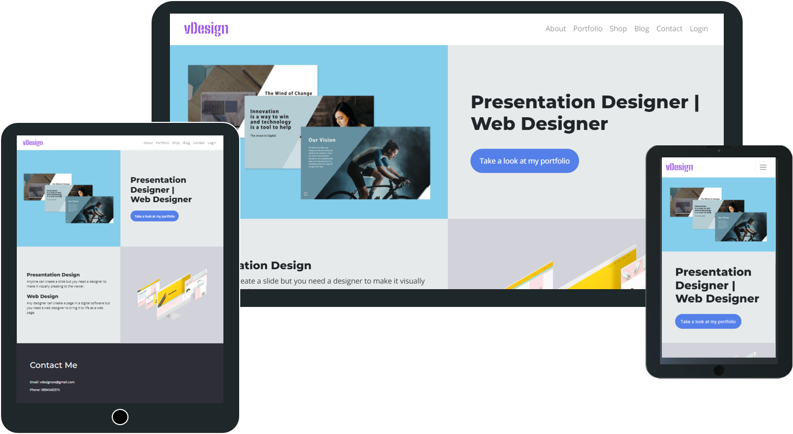

<div align="center">

<h2>vDesign</h2>
</div>

# vDesign

I am a Digital Designer who is expanding his skillset in depth into the web development space. This website is intended as a personal freelance site where I can highlight my work, provide templates and also scribble down snippets of my thoughts as a blog. I Users have the option to get a quick quote for my work depending on their requirements from the Contact page. 

You can find the deployed site [here](https://vdesign.herokuapp.com/)

## Table of Contents

1. [**UX**](#ux)
- [**Strategy**](#strategy)
- [**Scope**](#scope)
- [**Structure**](#structure)
- [**Skeleton**](#skeleton)
- [**Surface**](#surface)
  - [Existing Features](#existing-features)
  - [Features Left to Implement](#features-left-to-implement)
2. [**Technologies**](#technologies-used)
3. [**Testing**](#testing)
4. [**Deployment**](#deployment)
5. [**Credits & Acknowledgements**](#credits)

## UX

### User stories

As the site admin: 
- One of the main purpose of the site is to showcase my two core skills - PowerPoint design and web design/development
- I need a shopping page to sell already designed PowerPoint and Bootstrap templates for those who are looking for a quick and simple solution
- I need a page to pen down my thoughts about the two areas - PowerPoint and web. This helps in building confidence among users about my skills and also aids in some interaction with the users
- I should have a contact page ready for people looking to contact me 

As a user looking for freelancers:
- I need to see the previous work done by the individual to make sure he is capable of meeting my requirements
- I have some basic skills to carry out my work, so if there is anything that helps me to with my work without hiring the person full time, that would be an advantage
- Most of the freelancers need to be contacted to get their rates, if I can get a quick glance at their rates from their website for my requirements, that would be amazing

### Strategy

The idea of the project is to set up a website which serves as a personal portfolio while also helping me generate revenue. This needs to highlight my core skills, how knowledgable I am about those skills and also should be a place where people can hire me for work. 

### Scope

To understand what features needs to be included, I browsed the internet for other similar websites. I had a clear idea about what needs to be included from my side but I had to look at it from a client's perspective as well. For this, I did a quick interview with a couple of previous clients to understand what they would be looking for when searching for a freelancer. Based on all this, I identified these key areas:
1. A visually appealing home page which gives a quick glance at my core skill areas
2. An About page to give some understanding about my bakcgorund and journey
3. A portfolio page to showcase my previous work
4. A shop where users can buy prebuilt PowerPoint and Bootstrap templates
5. A profile page for users to login to update their details, this should also include details about their previous orders if any
6. A blog where I can talk about my thoughts about the two areas. Users should have the ability to add comments to have some level of interaction
7. A contact section for users to get in touch with me
8. A section where a quick quote is generated based on requirements entered by users

### Structure

There are 6 main pages including the home page and a login/registration page. Other than these, there is a base page which serves as the base for all the other pages. 

#### The home page
The home page gives gives a quick glance at my core skill areas and a link to the Portfolio page. 

#### About page

This page talks about who I am, what my background is and my journey till now. 

#### Portfolio page

This page showcases a few of my work in both Presentation Design and Web Development. Users can click into each which gives detailed information about the project and how I handled those with images of the project.

#### Shop page

This page provides a few prebuilt PowerPoint and Bootstrap templates which users can purchase. There is a filter to aid in the search. Once they click into a template, it takes them to a page which provides a bit more information about the template. From here, they can add this to the shopping bag. 

#### Shopping bag page

They can add this to cart and go to checkout or keep adding more products. There is a cart which shows the total which is calculated automatically based on the products they add. They can delete the products if no longer needed from this page or if they need to add more products, there is a button which takes them to the Shop page to buy more templates. Once they have added all the templates to the cart, they can go to the Checkout page by clicking on the Cart. <br>
NB: Shopping cart is added only in the Shop and shopping bag pages as they are only part of the site and not the main focus.

#### Checkout page

Here the user can enter their billing details to complete the checkout. If they need to update the cart at any point before billing, they have the option to go back to the Shop by clicking on a button. In this page, the users are provided with an option to save their details by logging into the site. If they don't want that option, they can click on Complete Order button to complete the transaction which triggers an automatic mail to their email address provided with the necessary details. If they want to save the details for future, they can register or login from the page or from the navbar. 

#### Login page

The users are provided with the option to register/login to create an account. For new users, they can redirect to the Sign up page from here. They need to include their email address, name and password to sign up. Once that is done, a confirmation link will be sent to their email address. Once the email is confirmed, they can login to the site. Logged in users have the ability to navigate to the Profile page. 

#### Profile page

The logged in users can update their billing details from this page. If they have made any previous purchases, those details are also shown in this page. 

#### Logout page

For users logged in, they can click on the logout button which takes them to this page to confirm that they need to logout. Clicking on the Sign out button logs them out from the site. 

#### Blog page

This page as the name suggests consists of a list of blogs written by the admin. Users can search for a blog by entering the keyword. The latest 3 blog posts are also highligted in this page, this option is only available in bigger screens and not in mobiles. Users can click into each blog to read the blog. Logged in users have the option to add comments. If they have previously added any comment, they can edit or delete their own comments.  

#### Contact page

This page provides a form which they can fill in to contact me. It also provides an emai address and phone number for contact if they dont want to use the form. 
This page provides a quote section where the users are given the option for a quick quote by filling in their requirements. 

#### Quote section

There are two buttons in this section - Presentation Design quote and Web Develpoment quote. The Web Development quote is currently in progress and just takes them to a page mentioning that. The Presentation Design quote button when clicked on takes them to a form where in they can enter their name, project name and has a multiselect form with a few requirements. Once the selection is made they can click Submit which generates a quote for them based on their requirements. Once the submit button is clicked, it takes them to a page a page with the lates quotes listed. From here, they can click on their project named button to view the quote. 

#### Management section

This section is available only for admin. This is a dropdown button in the navbar, when clicked on provides with three options 
1. Add a template - To add a new template to the Shop section
2. Add portfolio - To add a new work to the portfolio
3. Add blog - To add a new blog


### Skeleton

You can see the wireframes saved as pdf below:

[Wireframe for desktop](/wireframes/Wireframe_desktop.pdf)<br>
[Wireframe for tablet](/wireframes/Wireframe_tablet.pdf)<br>
[Wireframe for mobile](/wireframes/Wireframe_mobile.pdf)

### Surface

The website is created in an easily navigatable manner with sections added in the navbar. When user is not logged in, it includes About, Portfolio, Shop, Blog, Contact and login. When the user is logged in, My Profile appears and Login link turns to Logout. Superuser has an extra nav called management.<br>
The buttons and links - the information architecture is placed logically depending on the page <br>
The website is using a clean, minimalistic approach where a visually pleasing color scheme is used,<br>

The color scheme followed are:

-  `#5680E9` 
-  `#84CEEB`
-  `#5AB9EA`
-  `#C1C8E4`
-  `#8860D0`

The fonts used are Montserrat and Open Sans. Big Shoulders Stencil Display used for vDesign logo.

### Existing Features
1. Responsive layout: Site is accessable and scalable across devices
2. Users can purchase template from the shop. Filter added in this page to filter the products. 
3. Shopping cart updates total automatically based on purchase of products. Shopping cart is added only in the Shop and shopping bag pages as they are only part of the site and not the main focus.
4. Option to delete product from shopping bag
5. Portfolio and blogs can be viewed from their pages
6. Search feature added in Blog page. Latest 3 blogs shown in larger screens. Pagination added to navigate between blogs
7. Users can get an instant price quote based on their requirement for Presentation Design
8. Registration/login: Users can register or login with a username and password. 
9. Billing details can be updated from the profile page for logged in users
10. CRUD: Superuser can add products/templates, portfolio and blogs. Superuser have the functionality to edit or delete any of them as well. This feature is not available for all logged in users since they would not be aware of what to add, doesn't make sense to provide them with this capability. CRUD for logged in users are in the comments section of the blogs. Only logged in users have the capability to add comments. They can edit, or delete their own comments as well. Superuser has the ability to edit or delete any comments to prevent spam. 
11. Scroll to top button added which is a convenience especially when viewing fom tablet or mobile
12. Message success/alert/error/warning toasts depending on the function. These can be closed or will be closed automatically after 3 secs

### Features Left to Implement
- Currently the actual product is not sent, it is only a mockup. Capability to actually send the product on purchase to be added at a later stage. 
- Price quote to be added for Web Design as well
- Ideally user should be able to view their quote readily without any more further clicks once they fill in the requirements in the quote form. Currently, it takes them to a separate page with the latest quotes from where they can click on their project to view the quote. This feature to be added at a later stage. 

## Technologies Used

HTML <br>
CSS <br>
Google fonts <br>
Bootstrap <br>
Javascript/jQuery used as part of Bootstrap and also for few other functions <br>
Python 3 <br>
Django<br>
Stripe: The project uses Stripe's test payment functionality.<br>
SQLite: The project uses SQLite as the relational database to hold the backend information for the varions models used, when running locally<br>
PostgreSQL: The project uses Heroku's PostgreSQL relational database to hold the backend information for the various models used, when deployed remotely<br>
AWS S3 to store static and media files<br>
Heroku: The cloud based platform is used for deployment of the site. 
Gitpod: Gitpod IDE is used to write the code and push to Github
Github: Used as the remote reository to push and store the commited changes
Git version control: Used this a lot to track changes and refer when needed


## Testing

All the links have been manually tested. <br>
Tested if there are any problems in the coding or code styling from the Problems tab in Gitpod<br>
I used an [Excel](testing/Testing.xlsx) to update my testing. <br>
I have pasted a screenshot of that below. 


#### Validations

Validated html and css with W3C validator.

#### Noted errors and bugs

Portfolio page glitches in Safari, some images seem to be disappearing on hover. No solution found yet. 
Toasts in IE found to be smaller in size than intended. Functionality is there so ignored it for now as not crucial.

#### Responsiveness and browser compatibility

The website is created to be responsive, the way the results appear is different in mobile, tablet and desktop. <br>
Cross browser testing carried out with Google Chrome, Firefox, Opera, Edge, IE, Quant, Safari. Seems to be working except for the known errors mentioned above.<br>
Tested across multiple devices using devices directly where available and by using https://www.browserstack.com/ for others. <br>


## Deployment

I used Gitpod to develop the site using Python 3 and deployed to Heroku via Github. <br>

### Local deployment
1. To run the site locally, you can either download a zip file of this repository by clicking 'download.zip' button at the top of the page and extracting the zip file to your chosen folder or clone this repository. See the steps to clone the repo here : https://docs.github.com/en/github/creating-cloning-and-archiving-repositories/cloning-a-repository. <br>
If you are cloning the site, make sure you have Python 3 installed for this to work. 

2. Then create a virtual environment with your IDE. Open your preferred IDE, then open a terminal session in the unzip folder or cd to the correct location. 

3. Install the required dependencies with the following command:
```
pip3 install -r requirements.txt
```

4. Create an env.py file and add the following with your own values:
```
import os  
os.environ["DEVELOPMENT"] = "True"    
os.environ["SECRET_KEY"] = "<your value>"    
os.environ["STRIPE_PUBLIC_KEY"] = "<your value>"    
os.environ["STRIPE_SECRET_KEY"] = "<your value>"    
os.environ["STRIPE_WH_SECRET"] = "<your value>" 
os.environ["EMAIL_USER"] = "<your value>"
os.environ["EMAIL_PASS"] = "<your value>"
```
(Django Secret Keys can be generated with websites such as [miniwebtool](https://miniwebtool.com/django-secret-key-generator/).)

5. Add the env.py files to .gitignore so that it is not published at any stage. This is to keep the secret keys and values safe.

6. You need to make migrations to set up the SQLite3 tables. You can do that by:
```
python3 manage.py makemigrations
python3 manage.py migrate
```

7. Create a superuser for your project by using the following command:

```
python3 manage.py createsuperuser
```

8. You can now run this locally by the following command:

```
python3 manage.py runserver
```

9. Once the site is running locally, go to the end of the url and type in /admin to add templates, portfolio, blogs, quote etc.


### Deploying this project to Heroku 

Once you have set up locally, you can deploy to Heroku by following the below steps:

1. Create an account in Heroku if you dont have one or sign in if you have an existing one

2. In Heroku, create a new app with a unique name and set your registration

3. To use the Postgres database for deployment, select 'Heroku Postgres' as a free add-on.

4. Go to Settings in Heroku, click on 'Reveal Config Variables' and enter the following values

| **Key** | **Value** |
--- | ---
 AWS_ACCESS_KEY_ID | your AWS bucket ID
 AWS_SECRET_ACCESS_KEY | your AWS secret key
 DATABASE_URL | your Heroku Postgres database url
 EMAIL_HOST_PASS | your password to use your gmail account for emails
 EMAIL_HOST_USER | your email address
 SECRET_KEY | secret key used for your Django project
 STRIPE_PUBLIC_KEY | obtained through your Stripe account
 STRIPE_SECRET_KEY | obtained through your Stripe account
 STRIPE_WH_SECRET | obtained through your Stripe account
 USE_AWS | True

 5. You need to login to Stripe, go to the developers section to get the pubic key ad secret key. For the AWS secret key, you need to login to AWS and create a new bucket

 5. In Gitpod, create a requirements.txt file:
```
pip3 freeze --local > requirements.txt
```

6. Create a Procfile:
```
echo web: gunicorn hotel_eko.wsgi:application > Procfile
```

7. As with local deployment, make migrations to set up the Postgres database:
```
python3 manage.py makemigrations
python3 manage.py migrate
```

8. Create a superuser similar to the way in local deployment

9. Run the server

10. As with the local deployment, add /admin to the url to go to the admin and add or edit 

11. Add and commit your changes

12. Login to Heroku by using the command 
```
heroku login -i
```
13. Once logged in, link your Heroku app created above as the remote repository with this command:
```
heroku git:remote -a <your app name here>
```
14. Complete the deployment by pushing the projekt to Heroku:
```
git push heroku master
``` 
15. In Heroku, go to the Deploy tab and connect your app to your GitHub repository and **Enable Automatic Deployment** as the deployment method to automatically push the changes to Heroku from Github

16. Your site would now be deployed to Heroku

## Credits

### Content

All the text content were written by me. 

### Media

All the images were created and added by me

### UI

Various graphic designer websites, Pinterest and Squarespace templates were gone through to create a design for the project. Parts of many of them are utilized in different areas along with my own customization to suit the needs of the site. 

### Acknowledgements

Shopping section hugely inspired by the mini project 'Boutique-Ado' done as part of the course with Code Institute. Although they are customized for the site, shop section is mainly drawn upon that miniproject.<br>
Blog section inspired by tutorials from [JustDjango](https://www.youtube.com/channel/UCRM1gWNTDx0SHIqUJygD-kQ) and [Codemy](https://www.youtube.com/channel/UCFB0dxMudkws1q8w5NJEAmw)<br>
I also followed Udemy course by Ashutosh Pawar for more understanding of Django concpets [Django Masterclass](https://www.udemy.com/course/django-course/)<br>
Arranging different sized images for portfolio found in [CSS Tricks](https://css-tricks.com/seamless-responsive-photo-grid/)
Scroll to top found [here](https://codepen.io/michalwyrwa/pen/GBaPPj)


Special thanks to my mentor Aaron Sinnott for helping me in the beginning and huge thanks to mentor Maranatha Ilesanmi for stepping in Aaron's absence.  

###### Disclaimer: This project was created for educational use only as part of the Code Institute Full Stack Software Development Course</i>
